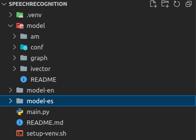

SpeechRecognition sample
========================

A small sample that shows how to use SpeechRecognition. You simply speak a sentence and the script
will try to recognize what you said and transform it into text. The main script tries to use the
engines Sphinx, Vosk and TensorFlow. The Vosk engine is the only one that works well in this sample.

# Set up

Run `setup-venv.sh` to a Python virtual environment with all the requirements.

On Linux, you'll need the development files of PortAudio to access the microphone. If you're on
Ubuntu 20.04, you can install them by running `sudo apt install portaudio19-dev`.

The Vosk engine requires you to download one of their models. Check
https://alphacephei.com/vosk/models, choose one of the models, download it and decompress the files
into a folder called `model` besides `main.py`. Your project should look like the following:

# Usage

With the virtual environment activated, run `python3 main.py` and speak any sentence. Alternatively,
use the `run-main.sh` script.
